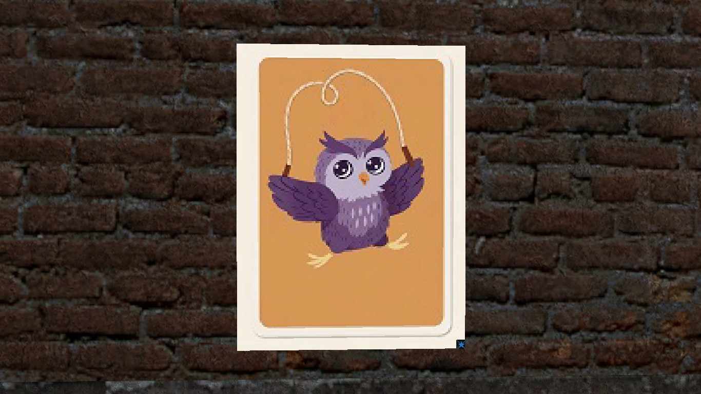
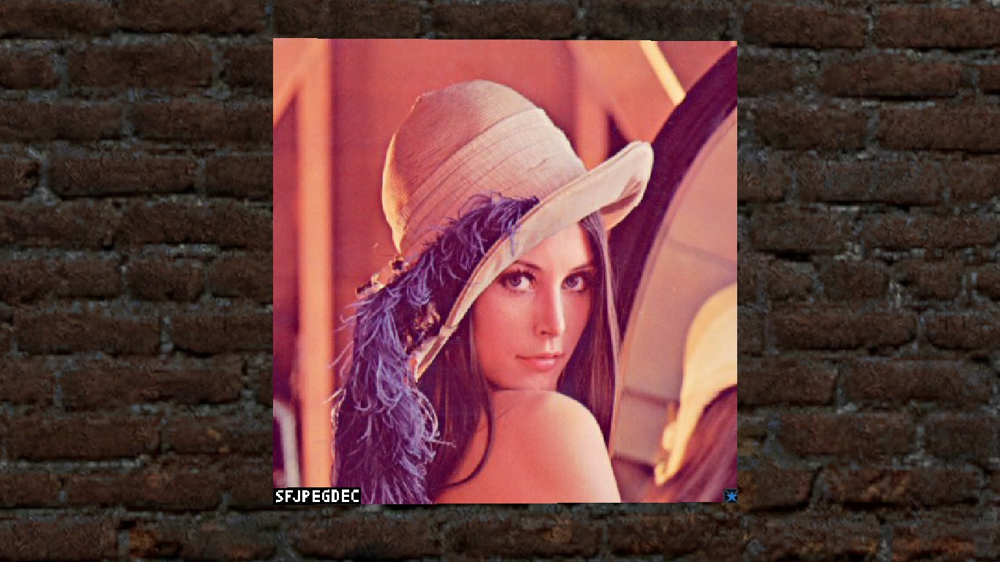
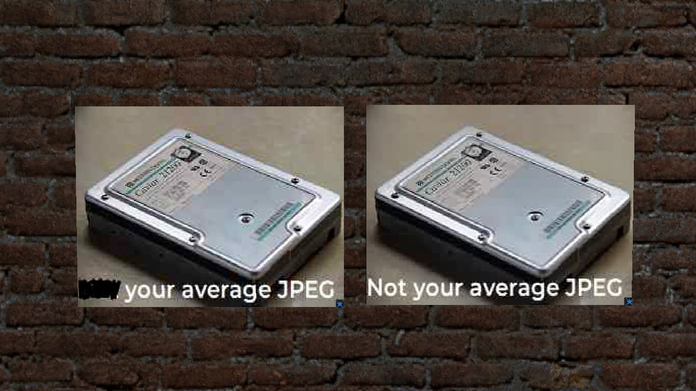

# SFJPEGDEC

## Overview
This is a baseline JPEG decoder that uses a wiremod digital screen made in starfall for gmod. 
Rather slow because it was made in gmod but can be useful as all pictures are loaded from your PC.

It supports:
- YCbCr 4:4:4; 4:4:0; 4:2:2; 4:2:0 jpegs
- Grayscale jpegs

It does not support:
- Progressive jpegs (will cause a huffman table error)
- Any other type of jpeg that isnt YCbCr (including RGB)
- Any jpeg which has more than 786432 pixels (a limitation of the wire digital screen)

## Usage

It uses a wiremod digital screen instead of a starfall screen so you must have wiremod installed.
The file path is relative to the game folder (eg. steamapps/common/GarrysMod/garrysmod)  
OpsLimit defines the max processor time in ms. I recommend setting this to 1-4  
Spawn a digital screen first and then place the chip on it. It will automatically configure the screen settings for the image  
Also set sf_net_burstmax_cl and sf_net_burstrate_cl to something high so the chip won't throw an error  

## Screenshots

### Basic JPG decoding

### Lena

### Custom encoded images

